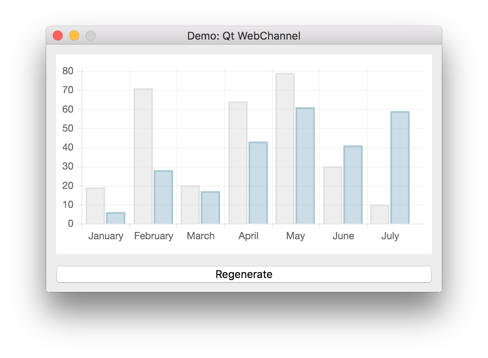

# Demo: Qt WebChannel

This project demonstrates how to transparently access between a Qt object and an HTML/JavaScript application via Qt WebChannel API.

## References

* [QWebChannel Class](http://doc.qt.io/qt-5/qwebchannel.html)
* [Qt WebChannel JavaScript API](http://doc.qt.io/qt-5/qtwebchannel-javascript.html)
